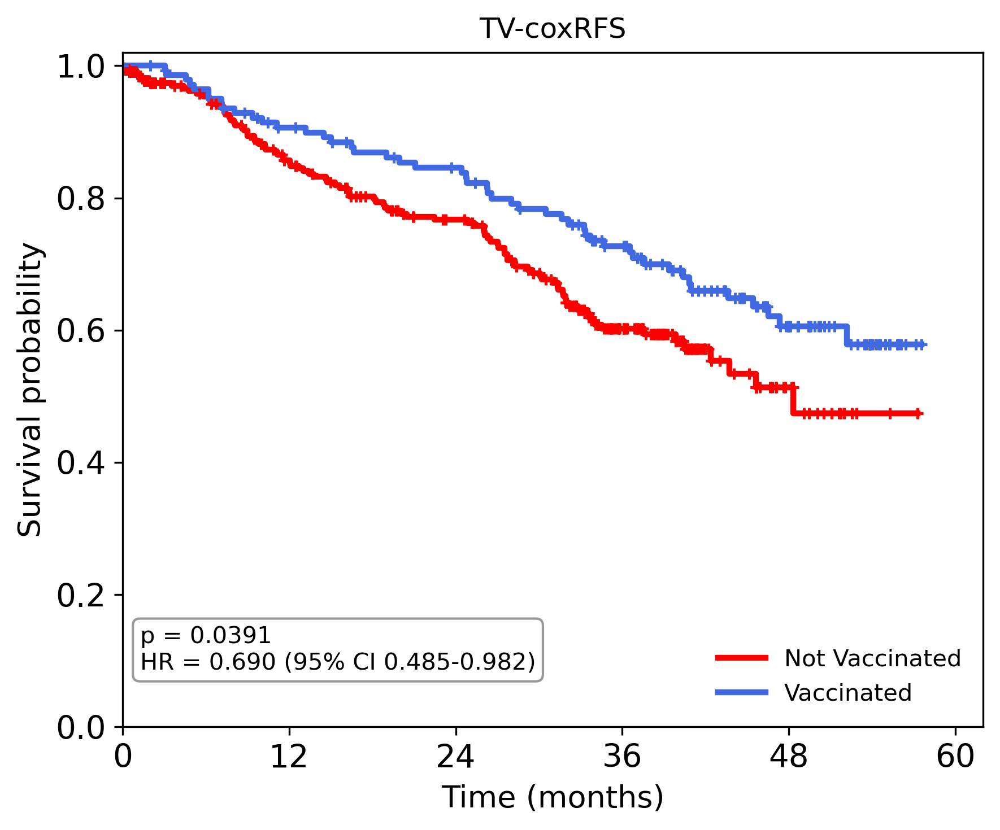
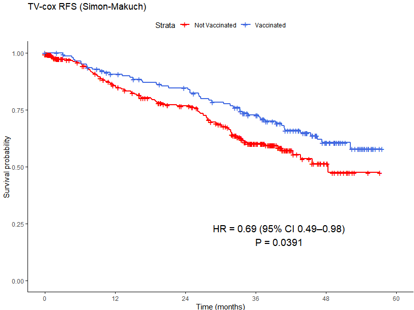
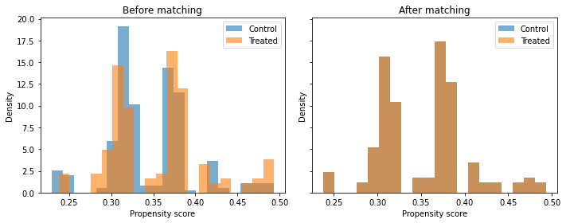
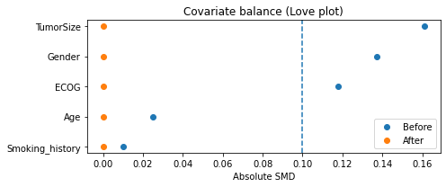
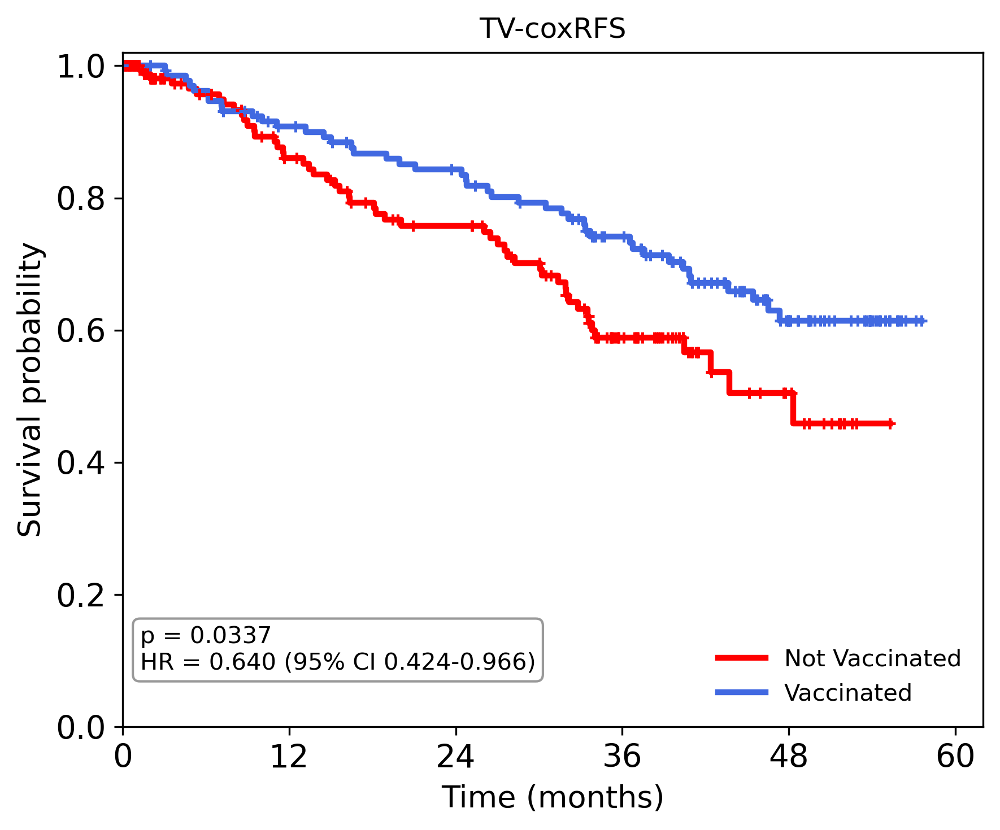
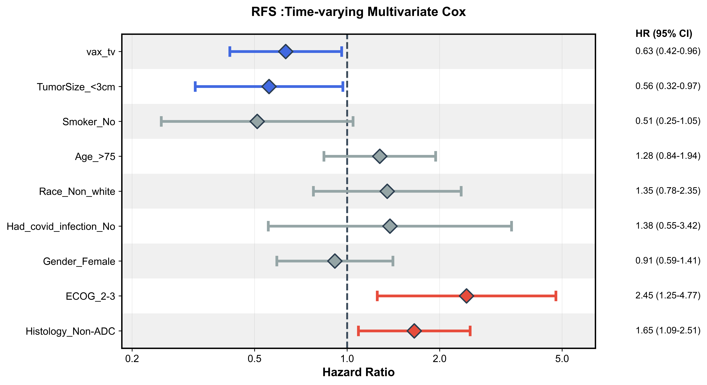

# VaxOnSABR
**SARS-CoV-2 mRNA Vaccination Improved Survival in NSCLC Treated with Radiotherapy**

---

## Overview

Stereotactic ablative radiotherapy (SABR) is the standard of care for early-stage non-small cell lung cancer (NSCLC) and has demonstrated immunomodulatory properties that have prompted investigation of its combination with immune checkpoint inhibitors. SARS-CoV-2 mRNA vaccines are potent activators of innate immunity and have been associated with improved survival in several advanced cancers when administered in proximity to immunotherapy.

However, the potential interaction between peri-SABR vaccination and clinical outcomes in early-stage NSCLC remains poorly characterized. We performed a retrospective study evaluating the impact of peri-SABR SARS-CoV-2 mRNA vaccination on recurrence-free survival (RFS) and overall survival (OS) in a real-world cohort of early-stage NSCLC patients treated during the COVID-19 pandemic era, with independent validation in the I-SABR trial cohort.

To address immortal-time and selection biases inherent to observational vaccine studies, analyses were performed using time-varying Cox proportional hazards models with Simon-Makuch visualization, propensity score matching, and multivariate confounder adjustment.

This repository holds the code for the **I-SABR-SELECT** framework, as described in *[citation forthcoming]*.

---
## Installation

To install the **development version** of I-SABR-SELECT using `pip`, run the following command:
```bash
pip install git+https://github.com/WuLabMDA/VaxOnSABR.git
```

Alternatively, I-SABR-SELECT can be cloned using the following command:
```bash
git clone https://github.com/WuLabMDA/VaxOnSABR.git
cd VaxOnSABR
```

---
## Repository Structure
```
VaxOnSABR/
├── Utils_fn/          # Utility functions
├── Main/              # Main figure scripts
├── Supp/              # Supplementary scripts
└── README.md
```

### 1. Utility Functions (`Utils_fn/`)
Functions supporting three types of analyses:
- Naive survival analysis
- Time-bias corrected analysis
- Selection bias corrected analysis

### 2. Main Scripts (`Main/`)
Scripts for generating the main figures:
- **Fig 1(a-b):** Time bias correction in real-world cohort
- **Fig 1(c-d):** Vaccination timing in real-world cohort
- **Fig 1(e-f):** Time bias correction on matched real-world cohort
- **Fig 1(g-h):** Selection-bias correction on matched real-world cohort


### 3. Supplementary Codes (`Supp/`)
Scripts for generating supplementary figures:
- **S2:** Survival outcome by Flu Vaccine and Covid Infection
- **S3:** Survival outcome in the I-SABR trial full cohort analysis
- **Propensity match diagnostics:** Generated alongside in section 2 under (d)

---

## Data Availability

The data utilized in this study can be provided upon reasonable request. Please visit the following Zenodo link to request access.

- **Data DOI:** [https://doi.org/10.5281/zenodo.19389276](https://doi.org/10.5281/zenodo.19389276)

---
## Tutorials

Full scripts are provided to generate exact results demonstrated in the paper. Tutorials are meant to demonstrate some important parts such as how immortal bias is being corrected, etc. Some tutorials are provided in both Python and R so that results can be verified and replicated on both platforms.

| Tutorial | Description |
|----------|-------------|
| Tutorial 1 | Immortal bias correction in unmatched population |
| Tutorial 2 | Immortal bias correction in matched population |
| Tutorial 3 | Selection bias correction |

---

### Tutorial 1: Immortal Bias Correction in Unmatched Population (Python)

Download data from Zenodo as provided in the link above.

```python
#---Import required libraries---
import numpy as np
import pandas as pd
import pathlib
import os

#---Import predefined functions--
import sys
sys.path.append(r'your path..... \Utils_fn')
import fn_utils as utils
import fn_bias_correction as bc

#---Read data and set visualization parameters (Real-world cohort as an example)---
df_data = pd.read_excel(os.path.join(root_dir, "Covid_data_v2.xlsx"), sheet_name='Main')

x_scale = [0, 12, 24, 36, 48, 60]  # censored at 5 years
extra_space = 2
k_min0 = 0
k_min1 = 0

#---Define endpoint---
time_col = 'RFS'
event_col = 'RFS_status'

#---Build time varying table using counting process---
cols = ['MRN', 'any_vax_3m_3m', time_col, event_col]
df_out = df_data[cols]

df_out.rename(columns={time_col: 'Time'}, inplace=True)
df_out.rename(columns={event_col: 'Event'}, inplace=True)
df_out['TX_EndDate'] = df_data['RT.End.Date']
df_out['Event_Date'] = df_data['Vaccine_Date']

#---run counting process---
long_df = bc.build_timevarying_table(df_out)

#---Simon-Makuch visualization---
figg, _, _ = bc.plot_simon_makuch([], long_df, 'TV-cox' + time_col, x_scale, extra_space, k_min0, k_min1)
```



---

### Tutorial 1: Immortal Bias Correction in Unmatched Population (R)

```r
#---Import required libraries---
library(survival)
library(survminer)
library(dplyr)
library(readxl)

#---Import Predefined functions---
setwd("your path here")
source("fn_utils.R")

#---Read data and set visualization parameters---
df <- read_excel(("Covid_data_v2.xlsx"), sheet = "Main")

#---Define endpoint---
time_col = 'RFS'
event_col = 'RFS_status'

#---Build time varying table using counting process---
cols <- c('MRN', 'any_vax_3m_3m', time_col, event_col, 'RT.End.Date', 'Vaccine_Date')
df_out <- df[cols]

names(df_out)[names(df_out) == time_col] <- "Time"
names(df_out)[names(df_out) == event_col] <- "Event"
names(df_out)[names(df_out) == "RT.End.Date"] <- "TX_EndDate"
names(df_out)[names(df_out) == "Vaccine_Date"] <- "Event_Date"

df_out$TX_EndDate <- as.Date(df_out$TX_EndDate)
df_out$Event_Date <- as.Date(df_out$Event_Date)
df_out$t_vax <- as.numeric(df_out$Event_Date - df_out$TX_EndDate) / 30

#---run counting process---
long_df <- build_timevarying_table(df_out)

#------Extract cox-tv metrics---
cox_tv <- coxph(Surv(start, stop, event) ~ vax_tv, data = long_df)
cox_sum <- summary(cox_tv)
HR <- round(cox_sum$coef[1, "exp(coef)"], 2)
pval <- signif(cox_sum$coef[1, "Pr(>|z|)"], 3)
lower_CI <- round(cox_sum$conf.int[1, "lower .95"], 2)
upper_CI <- round(cox_sum$conf.int[1, "upper .95"], 2)
label_text <- sprintf("HR = %.2f (95%% CI %.2f--%.2f)\nP = %.3g", HR, lower_CI, upper_CI, pval)

#-----Simon-Makuch visualization-----
fit_sm <- survfit(Surv(start, stop, event) ~ vax_tv, data = long_df, id = id)

p <- ggsurvplot(fit_sm,
  data = long_df,
  palette = c("red", "royalblue"),
  legend.labs = c("Not Vaccinated", "Vaccinated"),
  xlab = "Time (months)",
  ylab = "Survival probability",
  title = "TV-cox RFS (Simon-Makuch)",
  xlim = c(0, 60),
  break.x.by = 12,
  risk.table = FALSE,
  censor = TRUE,
  ggtheme = theme_classic())

p$plot <- p$plot + annotate("text", x = 40, y = 0.2, label = label_text, size = 5)
print(p)
```



---

### Tutorial 2: Immortal Bias Correction in Matched Population (Python)

```python
#-----Data prep for 1 to 1 matching-----
df_data = pd.read_excel("Covid_data_v2.xlsx", sheet_name='Main')

cols = ['MRN', 'any_vax_3m_3m', 'Age', 'Gender', 'TumorSize', 'ECOG',
        'Histology', 'Smoking_history', 'Race', 'Had_covid_infection']

base_df = df_data[cols].copy()
base_df = base_df.rename(columns={'any_vax_3m_3m': 'Treatment'})

hist_ref = 'ADC'
hist_other = 'Non-' + hist_ref
base_df = utils.mapping(base_df, hist_ref, hist_other)
base_df['Treatment'] = base_df['Treatment'].map({'No': 0, 'Yes': 1})

#-----Find match sample using PSM-----
covars = ['Age', 'TumorSize', "Gender", "ECOG", 'Smoking_history']
cal = 0.2
matched = utils.PSM(covars, base_df, cal)

#-----PSM diagnostics-----
utils.plot_ps_distributions(base_df, matched, ps_col="ps", treat_col="Treatment")

smd_before = utils.compute_smd_table(base_df, covars).rename(columns={"SMD": "SMD_before"})
smd_after = utils.compute_smd_table(matched, covars).rename(columns={"SMD": "SMD_after"})
smd = smd_before.merge(smd_after, on="Variable", how="inner")

print(tabulate(smd, headers='keys', tablefmt='pretty', showindex=False))
utils.loveplot(smd)
```





```python
#-----Then run time-bias correction-----
# Follow similar steps as in Tutorial 1 above using 'matched' output
df_matched = df_data[df_data['MRN'].isin(matched['MRN'])].reset_index(drop=True)
long_df = bc.build_timevarying_table(df_matched)
figg, _, _ = bc.plot_simon_makuch([], long_df, 'TV-cox' + time_col, x_scale, extra_space, k_min0, k_min1)
```



---

### Tutorial 3: Selection Bias Correction (Python)

There are three steps to perform:
1. Prepare the data (mapping, categorization, etc.)
2. Set the reference group
3. Multivariate adjustment

```python
#--Preprocess the data---
median = np.median(base_df['Age'])
base_df['Age'] = np.where(base_df['Age'] <= median, '<=75', '>75')
base_df['Smoking_history'] = np.where(base_df['Smoking_history'] == 'Never', 'No', 'Yes')
base_df['ECOG'] = np.where(base_df['ECOG'] <= 1, '0-1', '2-3')
base_df['Histology'] = np.where(base_df['Histology'] == hist_ref, hist_ref, hist_other)
base_df['TumorSize'] = pd.to_numeric(base_df['TumorSize'])

cut_off = 3
base_df['TumorSize'] = np.where(base_df['TumorSize'] < cut_off, '<3cm', '>=3cm')
base_df = base_df.rename(columns={'Smoking_history': 'Smoker', 'Event_Date': 'Vaccine_Date'})

#--Set reference--
base_df["Gender"] = pd.Categorical(base_df["Gender"], categories=["Male", "Female"])
base_df["Smoker"] = pd.Categorical(base_df["Smoker"], categories=["Yes", "No"])
base_df["Had_covid_infection"] = pd.Categorical(base_df["Had_covid_infection"], categories=["Yes", "No"])
base_df["Race"] = pd.Categorical(base_df["Race"], categories=["White", "Non_white"])
base_df["ECOG"] = pd.Categorical(base_df["ECOG"], categories=["0-1", "2-3"])
base_df["Histology"] = pd.Categorical(base_df["Histology"], categories=[hist_ref, hist_other])
base_df["TumorSize"] = pd.Categorical(base_df["TumorSize"], categories=[">=3cm", "<3cm"])

#--Multivariate analysis---
covariates = ["Age", "TumorSize", "Gender", "Smoker", 'Race', "Had_covid_infection", 'Histology', 'ECOG']
df_bias = base_df.copy()

uni_test, multi_test, summ_test = bc.run_correct_sel_bias(df_bias, covariates, pen=0.0)

results = pd.DataFrame({
    "Model": ["Univariate-" + time_col, "Adjusted-" + time_col],
    "p-value": [uni_test['p'][0], multi_test['p'][0]]
})

print(results)
```


